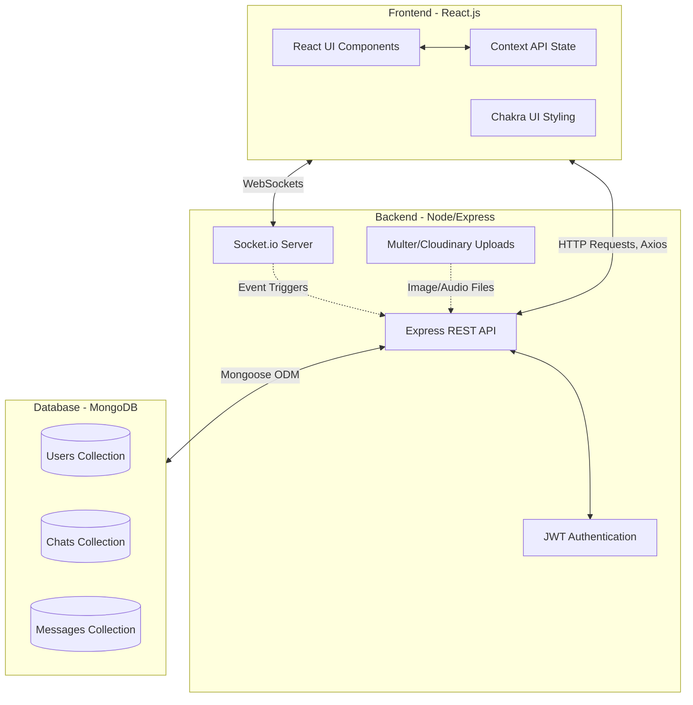

# 💬 Chit-Chat: Real-Time Messaging App


> [!NOTE]
> A full-stack, real-time chat application featuring 1-on-1 messaging, group chats, media sharing, and instant typing indicators.

---

## 1. System Overview

Chit-Chat is built on the highly scalable **MERN Stack** (MongoDB, Express.js, React, Node.js) with real-time socket connections. The architecture is split into three primary layers:
1. **Client Tier (Frontend)**: React.js application responsible for UI/UX and local state management.
2. **Application Tier (Backend API)**: Node.js/Express server handling authentication, business logic, and API endpoints.
3. **Data & Real-Time Tier**: MongoDB for persistent data storage and Socket.io for instantaneous bi-directional communication.

---

## 2. Architecture Diagram



---

## 3. Tech Stack Breakdown

### Frontend (Client-Side)
- **Framework**: React.js
- **Routing**: React Router DOM (`react-router-dom`)
- **State Management**: React Context API (`ChatProvider`)
- **UI Library**: Chakra UI (for sleek, accessible, and responsive components)
- **Animations**: React Lottie (for typing indicators and micro-interactions)
- **HTTP Client**: Axios

### Backend (Server-Side)
- **Environment**: Node.js
- **Framework**: Express.js
- **Real-Time Engine**: Socket.io v4
- **Security**: 
  - `bcryptjs` (Password hashing)
  - `jsonwebtoken` (Stateless authentication)
- **Media Handling**: `multer` & `cloudinary` (for profile pictures and chat attachments)

### Database (Data-Side)
- **Database**: MongoDB
- **ODM**: Mongoose

---

## 4. Data Models (Schema)

The database is normalized into three core collections to ensure scalability and fast read operations.

### User Schema (`/models/userModel.js`)
Stores authentication data and user profile information.
| Field | Type | Description |
|---|---|---|
| `name` | String | Display name of the user |
| `email` | String | Unique login email |
| `password` | String | Bcrypt hashed password |
| `pic` | String | URL to Cloudinary hosted avatar |

### Chat Schema (`/models/chatModel.js`)
Represents both 1-on-1 conversations and Group Chats.
| Field | Type | Description |
|---|---|---|
| `chatName` | String | Name of the chat (useful for groups) |
| `isGroupChat` | Boolean | Flag to determine chat type |
| `users` | Array of ObjectIds | References to `User` models |
| `latestMessage` | ObjectId | Reference to the most recent `Message` model |
| `groupAdmin` | ObjectId | Reference to `User` (if group chat) |
| `groupPic` | String | Optional avatar for group chats |

### Message Schema (`/models/messageModel.js`)
Stores individual text and media messages.
| Field | Type | Description |
|---|---|---|
| `sender` | ObjectId | Reference to `User` |
| `content` | String | Text payload of the message |
| `chat` | ObjectId | Reference to the parent `Chat` |
| `images` | Array of Strings | URLs to uploaded media (Images/Audio) |

> [!TIP]
> Audio messages and Images share the `images` array field. The frontend dynamically parses the file extensions (`.mp3`, `.wav`, etc.) to render the correct HTML element (`<audio>` vs ``).

---

## 5. Real-Time Communication Flow

Socket.io is configured to create isolated "rooms" for every chat, ensuring that messages are only broadcasted to users currently viewing that specific conversation.

### Socket Events Lifecycle
1. **Connection**: Client connects to WS and emits `setup` with their User ID.
2. **Joining a Room**: When a user clicks a chat, the client emits `join chat` with the Chat ID. The server adds the socket to that isolated room.
3. **Typing Indicators**: 
   - User types -> Emits `typing` to room.
   - Server broadcasts `typing` to all other sockets in room.
   - Frontend renders the Lottie animation bubble inside `ScrollableChat`.
4. **Sending Messages**:
   - Client sends HTTP POST request to `/api/message`.
   - Server saves message to MongoDB.
   - Server emits `new message` event over WebSockets containing the full populated message object.
   - Clients in the room receive the event and append the message to their local state instantly.

---

## 6. Authentication Flow

> [!IMPORTANT]
> Chit-Chat utilizes stateless JWT (JSON Web Tokens) for security. No sessions are stored on the server.

1. **Login/Signup**: Client sends credentials to `/api/user/login`.
2. **Token Generation**: Server verifies credentials, signs a JWT using the `JWT_SECRET`, and returns it alongside the user object.
3. **Storage**: Client stores the payload in browser `localStorage`.
4. **Authorization**: For all subsequent protected API requests (fetching chats, sending messages), the client attaches the JWT in the `Authorization: Bearer <token>` header. Express middleware (`protect`) intercepts the request, verifies the token, and attaches the authenticated user to the `req` object.

---

## 7. Local Installation & Setup

1. **Clone the repository:**
   ```bash
   git clone https://github.com/rajathvinod/Chit-Chat.git
   cd Chit-Chat
   ```

2. **Install Dependencies:**
   ```bash
   npm run build
   ```
   *(This custom script installs both backend and frontend dependencies automatically).*

3. **Environment Variables:**
   Create a `.env` file in the root directory and add your configurations:
   ```env
   PORT=5000
   MONGO_URI=your_mongodb_connection_string
   JWT_SECRET=your_secret_key
   CLOUDINARY_CLOUD_NAME=your_cloud_name
   CLOUDINARY_API_KEY=your_api_key
   CLOUDINARY_API_SECRET=your_api_secret
   ```

4. **Run the Application:**
   ```bash
   # Terminal 1: Start the backend server
   npm run server

   # Terminal 2: Start the frontend React app
   cd frontend
   npm start
   ```

**Enjoy your new real-time chat app! 🎉**
